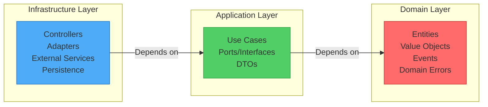

# Hexagonal Image Service

REST API for image processing built with NestJS and TypeScript following a Hexagonal Architecture (Ports & Adapters).

## 🎯 Overview

This project implements a REST service for image processing that:

- Receives a local path or URL to an image
- Generates two resized variants (1024px and 800px width)
- Maintains the original aspect ratio
- Stores processed images with filenames based on MD5 hash
- Manages the lifecycle of processing tasks (pending → completed/failed)
- Assigns a random price between 5 and 50 to each task

### Main Technologies

- Framework: NestJS 11
- Language: TypeScript 5.7
- Database: MongoDB 7.0
- Image processing: Sharp 0.34
- Documentation: Swagger/OpenAPI
- Testing: Jest 30 (unit and integration)

---

## 🏗 Architecture

### Hexagonal Architecture

The project follows the principles of Hexagonal Architecture (Ports & Adapters), separating business logic from external technical concerns.


### System Layers



#### 1. Domain (Business Core)

Contains pure business logic, independent from frameworks and external technologies.

- Entities:
  - ImageProcessingTask (Aggregate Root): Manages task lifecycle
  - ImageVariant: Represents a processed image at a specific resolution
- Value Objects:
  - Money: Immutable price between 5-50
  - Resolution: Valid resolutions (1024px, 800px)
  - ImageSource: Validation for paths and URLs
  - Md5Hash: File fingerprinting
- Domain Events:
  - TaskCreatedEvent: Fired when a task is created
  - ImageProcessedEvent: Fired when processing completes
  - ImageProcessingFailed: Fired on processing errors

- Domain invariants:
  - A completed task must have exactly 2 variants
  - Price is immutable once assigned
  - Valid transitions: pending → completed or pending → failed

#### 2. Application (Orchestration)

Defines use cases and the contracts (ports) that infrastructure must implement.

- Use Cases:
  - CreateImageProcessingTask: Creates a new processing task
  - GetImageProcessingTask: Retrieves task status
- Ports (Interfaces):
  - TaskRepository: Task persistence
  - ImageProcessor: Image processing
  - FileDownloader: File download
  - EventBus: Event system
  - IdGenerator: ID generation

#### 3. Infrastructure (Technical Details)

Implements adapters for the ports defined in the application layer.

- Controllers: TaskController (REST endpoints with NestJS)
- Adapters:
  - MongoTaskRepository: Persistence implementation for MongoDB
  - SharpImageProcessor: Processing using Sharp
  - FileDownloaderService: Local/remote file downloader
- Listeners: Subscribe to domain events to trigger processing
- Filters: Exception filters mapping domain errors to HTTP responses

### Processing Flow


### Directory Structure

```
src/
├── domain/                      # Domain layer
│   ├── entities/               # Entities and Aggregate Roots
│   │   ├── image-processing-task.model.ts
│   │   └── image-variant.model.ts
│   ├── value-objects/          # Immutable Value Objects
│   │   ├── money.value.ts
│   │   ├── resolution.value.ts
│   │   ├── image-source.value.ts
│   │   └── md5hash.value.ts
│   ├── events/                 # Domain Events
│   │   ├── task-created.event.ts
│   │   ├── image-processed.event.ts
│   │   └── image-processing-failed.event.ts
│   └── errors/                 # Domain Errors
│       ├── domain.error.ts
│       ├── task-not-found.error.ts
│       └── ...
│
├── application/                 # Application layer
│   ├── use-cases/              # Use cases
│   │   ├── create-image-processing-task.use-case.ts
│   │   └── get-image-processing-task.use-case.ts
│   ├── ports/                  # Interfaces (Ports)
│   │   ├── task.repository.ts
│   │   ├── image.processor.ts
│   │   ├── file.downloader.ts
│   │   ├── event.bus.ts
│   │   └── id.generator.ts
│   └── dtos/                   # Data Transfer Objects
│       ├── create-task.dto.ts
│       └── get-task.dto.ts
│
├── infrastructure/              # Infrastructure layer
│   ├── controllers/            # REST Controllers
│   │   └── task.controller.ts
│   ├── repositories/           # Repository implementations
│   │   ├── mongo-task.repository.ts
│   │   └── in-memory-task.repository.ts
│   ├── services/               # Service implementations
│   │   ├── sharp-image.processor.ts
│   │   └── file-downloader.service.ts
│   ├── listeners/              # Event listeners
│   │   └── image-processed.listener.ts
│   ├── filters/                # Exception Filters
│   │   └── domain-exception.filter.ts
│   ├── modules/                # NestJS Modules
│   │   └── task.module.ts
│   └── dtos/                   # API DTOs (validation)
│       ├── create-task.dto.ts
│       └── get-task.dto.ts
│
├── app.module.ts               # Main module
└── main.ts                     # Entry point
```

---

## 💡 Technical Decisions

### 1. Hexagonal Architecture

Decision: Implement strict hexagonal architecture with clear separation of layers.

Arguments:

- Testability: Domain can be tested without external dependencies
- Maintainability: Infrastructure changes do not affect business logic
- Flexibility: Easy to swap adapters (e.g., MongoDB → PostgreSQL)
- Clarity: Explicit separation of responsibilities

Trade-offs:

- More files and abstractions
- Learning curve for developers unfamiliar with the pattern

### 2. Synchronous Processing with Events

Decision: Use domain events to trigger image processing, but execute synchronously in the same process.

Arguments:

- Simplicity: No queue infrastructure required (Redis, RabbitMQ)
- Adequate for expected load
- Fast development and fewer external dependencies
- Easy to migrate to async workers later

Trade-offs:

- Endpoints may take longer overall (though they respond 201 before processing)
- No distributed load across workers
- Retry logic on failures must be implemented manually

### 3. MongoDB as Database

Decision: Use MongoDB with embedded documents for tasks and variants.

Arguments:

- Natural data model: variants are part of the task aggregate
- Simple queries: typically fetch the task with its variants
- No joins: better read performance
- Schema flexibility: easy to add fields without migrations

Task document example:

```json
{
    _id: '06ks2xz',
    status: 'completed',
    price: 50,
    createdAt: ISODate('2025-11-04T17:51:13.563Z'),
    updatedAt: ISODate('2025-11-04T17:52:20.143Z'),
    originalPath: 'https://images.unsplash.com/photo-1648733366513-7cefc88f28ca?ixlib=rb-4.1.0&ixid=M3wxMjA3fDB8MHxzZWFyY2h8Mnx8bG9ybyUyMGdyYW5kZXxlbnwwfHwwfHx8MA%3D%3D&fm=jpg&q=60&w=3000',
    images: [
      {
        resolution: '1024',
        path: 'images/output/photo-1648733366513-7cefc88f28ca/1024/2de2dd79923887f8ce34bb4912985bab.jpg',
        md5: '2de2dd79923887f8ce34bb4912985bab'
      },
      {
        resolution: '800',
        path: 'images/output/photo-1648733366513-7cefc88f28ca/800/2de2dd79923887f8ce34bb4912985bab.jpg',
        md5: '2de2dd79923887f8ce34bb4912985bab'
      }
    ]
  }
```

Optional images collection example:

```json
{
    _id: '06ks2xz_1024',
    taskId: '06ks2xz',
    resolution: '1024',
    path: 'images/output/photo-1648733366513-7cefc88f28ca/1024/2de2dd79923887f8ce34bb4912985bab.jpg',
    md5: '2de2dd79923887f8ce34bb4912985bab',
    timestamp: ISODate('2025-11-04T17:52:20.143Z')
  },
  {
    _id: '06ks2xz_800',
    taskId: '06ks2xz',
    resolution: '800',
    path: 'images/output/photo-1648733366513-7cefc88f28ca/800/2de2dd79923887f8ce34bb4912985bab.jpg',
    md5: '2de2dd79923887f8ce34bb4912985bab',
    timestamp: ISODate('2025-11-04T17:52:20.143Z')
  }
```

Trade-offs:

- No ACID consistency between collections
- Data duplication between tasks and images collections

### 4. Local Image Storage

Decision: Save processed images on the local filesystem under /images/output/.

Storage pattern: /output/{original_name}/{resolution}/{md5}.{ext}

Arguments:

- Simplicity: no S3/bucket setup required
- Easy to inspect and debug locally
- No cloud storage costs
- Sufficient for an MVP

Trade-offs:

- Not horizontally scalable (each instance has its own filesystem)
- No integrated CDN
- Backups depend on the server filesystem

### 5. Immutable Value Objects

Decision: Use Value Objects for domain concepts (Money, Resolution, ImageSource, Md5Hash).

Arguments:

- Centralized validation
- Immutability prevents accidental changes
- Type safety with TypeScript
- Improved expressiveness (e.g., Money.randomBetween())

Example:

```typescript
// ❌ Before (primitive)
const price = Math.random() * 45 + 5;

// ✅ After (Value Object)
const price = Money.randomBetween(); // Encapsulates logic and validation
```

### 6. Aggregate Root: ImageProcessingTask

Decision: ImageProcessingTask is the Aggregate Root that controls access to ImageVariant.

Arguments:

- Consistency: only the task can modify its variants
- Invariants guaranteed: task ensures exactly 2 variants when completed
- All changes go through the aggregate

Implemented invariants:

```typescript
// Only add variants when task is pending
addVariant(variant: ImageVariant) {
  if (this._status !== 'pending') {
    throw new AddVariantError('Cannot add variants to non-pending task');
  }
  this._variants.push(variant);
}

// Can only complete when there are exactly 2 variants
  complete() {
    if (this._status !== 'pending') {
      throw new CompleteTaskError('Only pending tasks can be completed');
    }
    if (this._variants.length !== 2) {
      throw new CompleteTaskError(
        'A completed task must have exactly 2 variants',
      );
    }
    this._status = 'completed';
  }
```

### 7. Domain Events vs Integration Events

Decision: Use domain events for internal communication; ready for integration events later.

Arguments:

- Decoupling: use case doesn't know the image processor
- Extensibility: easy to add listeners (email, notifications)
- CQRS-ready: foundation for adding CQRS later

Implementation example:

```typescript
// Use case publishes event
await this.eventBus.publish(new TaskCreatedEvent(id, source.uri));

// Processor subscribes to the event
this.eventBus.subscribe(TaskCreatedQueue, async (ev: TaskCreatedEvent) => {
  await this.onTaskCreated(ev);
});
```

### 8. Testing Strategy

Decision: Unit tests colocated with code (src/), integration tests in test/ folder.

Structure:

```
src/
  domain/
    entities/
      image-processing-task.model.ts
      image-processing-task.spec.ts        # ← Unit test
  application/
    use-cases/
      create-image-processing-task.use-case.ts
      create-image-processing-task.spec.ts  # ← Unit test
test/
  tasks.e2e-spec.ts                         # ← E2E test
```

Arguments:

- Unit tests near code improve navigation
- Fast feedback from unit tests
- E2E tests isolated in test/ for CI
- CI can run unit and E2E separately

Coverage status:

- Domain: ~95%
- Application: ~90%
- Infrastructure: ~75% (controllers & adapters)
- Global: >80%

### 9. Sharp for Image Processing

Decision: Use Sharp library for image processing.

Arguments:

- Performance: based on libvips
- Supports many formats (JPEG, PNG, WebP, AVIF, TIFF, GIF, SVG)
- Ergonomic API
- Actively maintained

### 10. Swagger for Documentation

Decision: Use Swagger/OpenAPI with NestJS decorators.

Arguments:

- Live documentation that updates with code
- Interactive testing UI at /api/docs
- Generate clients automatically
- Industry standard

Access: http://localhost:3000/api/docs

### 11. No Authentication in MVP

Decision: No authentication or authorization in this initial version.

Arguments:

- Focused scope for the technical task
- Simplicity
- Architecture ready to add auth later

For production, you'd need:

- JWT authentication
- Rate limiting
- API keys or OAuth2
- Request origin validation

### 12. TypeScript Strict Mode

Decision: Enable strict TypeScript mode (strict: true).

Arguments:

- Stronger type safety
- Explicit null handling
- Better DX with precise IntelliSense
- Fewer runtime bugs

Configuration example:

```json
{
  "compilerOptions": {
    "strict": true,
    "strictNullChecks": true,
    "strictFunctionTypes": true,
    "noImplicitAny": true
  }
}
```

### 13. Commit Conventions

Decision: Use Conventional Commits with Husky + Commitlint.

Arguments:

- Clear commit history
- Automatic changelog generation
- Supports semantic versioning
- Known standard for collaboration

Format: <type>(<scope>): <subject>

Allowed types: feat, fix, docs, style, refactor, test, chore

### 14. Error Handling with Filters

Decision: Use NestJS Exception Filters to map domain errors to HTTP responses.

Arguments:

- Separation of concerns: domain doesn't know HTTP status codes
- Consistent error format across API
- Single place to map errors

Example filter:

```typescript
@Catch(DomainError)
export class DomainExceptionFilter implements ExceptionFilter {
  catch(exception: DomainError, host: ArgumentsHost) {
    const ctx = host.switchToHttp();
    const response = ctx.getResponse<Response>();

    const type = exception.name;

    switch (type) {
      case InvalidImageSourceError.name:
        return response.status(HttpStatus.BAD_REQUEST).json({
          message: [exception.message],
          error: exception.constructor.name,
          statusCode: HttpStatus.BAD_REQUEST,
        });
      case TaskNotFoundError.name:
        return response.status(HttpStatus.NOT_FOUND).json({
          message: [exception.message],
          error: exception.constructor.name,
          statusCode: HttpStatus.NOT_FOUND,
        });
      default:
        return response.status(HttpStatus.INTERNAL_SERVER_ERROR).json({
          statusCode: HttpStatus.INTERNAL_SERVER_ERROR,
          error: 'Internal server error',
          type: exception.constructor.name,
        });
    }
  }
}
```

---

## 📦 Prerequisites

Before starting, ensure you have:

- Node.js >= 18.x (recommended 20.x LTS)
- npm >= 9.x
- Docker >= 20.x (optional, for MongoDB)
- MongoDB 7.0 recommended Docker image

Verify installations:

```bash
node --version
npm --version
docker --version  # optional
```

---

## 🚀 Installation and Configuration

### 1. Clone the repository

```bash
git clone https://github.com/your-user/hexagonal-image-service.git
cd hexagonal-image-service
```

### 2. Install dependencies

```bash
npm install
```

This installs NestJS, Sharp, Mongoose, Jest, TypeScript and dev tools.

### 3. Configure environment variables

Create a .env file at project root (optional — defaults exist):

```env
# Server port (default: 3000)
PORT=3000

# MongoDB URI (default: mongodb://localhost:27017/image_service)
MONGO_URI=mongodb://localhost:27017/image_service
```

### 4. Start MongoDB

Option A: Use Docker (recommended)

```bash
npm run docker:up
```

This brings up MongoDB via docker-compose.

### 5. Prepare database (optional)

If you need migrations or setup:

```bash
npm run db:setup
```

This:

1. Starts Docker with MongoDB (`docker:up`)
2. Waits 5 seconds for MongoDB readiness
3. Runs migration script (`db:migrate`)

### 6. Create output directory

Ensure output directory exists and is writable:

```bash
mkdir -p images/output
```

Optionally, `images/input` can contain sample images.

### 7. Start the application

Development (hot-reload):

```bash
npm run start:dev
```

Production:

```bash
npm run build
npm run start:prod
```

App available at: http://localhost:3000
Swagger docs: http://localhost:3000/api/docs

---

## 📜 Available Scripts

### Development

| Script                | Description                                 |
| --------------------- | ------------------------------------------- |
| `npm run start`       | Start the app in normal mode                |
| `npm run start:dev`   | Start with hot-reload (recommended)         |
| `npm run start:debug` | Start in debug mode (Node inspector)        |
| `npm run build`       | Compile TypeScript to JavaScript in `/dist` |

### Testing

| Script               | Description                                          |
| -------------------- | ---------------------------------------------------- |
| `npm run test`       | Run unit tests (/\*.spec.ts in src/)                 |
| `npm run test:watch` | Run tests in watch mode                              |
| `npm run test:cov`   | Run tests and produce coverage report in `/coverage` |
| `npm run test:debug` | Run tests in debug mode                              |
| `npm run test:e2e`   | Run end-to-end integration tests (files in `test/`)  |

Examples:

```bash
# Unit tests with watch
npm run test:watch

# E2E tests
npm run test:e2e

# Coverage
npm run test:cov
```

### Code Quality

| Script           | Description                      |
| ---------------- | -------------------------------- |
| `npm run lint`   | Run ESLint and auto-fix problems |
| `npm run format` | Format code with Prettier        |

### Database & Docker

| Script                   | Description                                             |
| ------------------------ | ------------------------------------------------------- |
| `npm run docker:up`      | Start MongoDB in Docker                                 |
| `npm run docker:down`    | Stop and remove Docker containers                       |
| `npm run docker:logs`    | Show MongoDB logs                                       |
| `npm run docker:restart` | Restart MongoDB container                               |
| `npm run db:migrate`     | Run database migration script (`scripts/migrate-db.ts`) |
| `npm run db:setup`       | Full setup: start Docker + run migrations               |

### Others

| Script            | Description                                        |
| ----------------- | -------------------------------------------------- |
| `npm run prepare` | Configure Husky for git hooks (runs automatically) |

---

## 🔌 API Usage

### Interactive docs (Swagger)

Open `http://localhost:3000/api/docs` to explore the API.

### Endpoints

#### 1. Create Processing Task

POST /tasks

Create a new image processing task.

Request body:

```json
{
  "source": "/local/path/image.jpg"
}
```

Or with URL:

```json
{
  "source": "https://example.com/image.jpg"
}
```

Response (201 Created):

```json
{
  "taskId": "nisgqja",
  "price": 40,
  "status": "pending"
}
```

cURL example:

```bash
curl -X POST http://localhost:3000/tasks \
  -H "Content-Type: application/json" \
  -d '{"source": "/images/input/test.jpg"}'
```

Validations:

- `source` is required
- Must be a valid local path or a URL with http/https

#### 2. Get Task Status

GET /tasks/:id

Retrieve the current status and details of a task.

Response (200 OK) — Pending:

```json
{
  "status": "pending",
  "price": 40,
  "paths": []
}
```

Response (200 OK) — Completed:

```json
{
  "taskId": "nisgqja",
  "status": "completed",
  "price": 40,
  "images": [
    {
      "resolution": "1024",
      "path": "images/output/pngtree-cute-cartoon-beach-bear-illustration-png-image_7506687/1024/70036078a8c80f735aaf05306f30e183.png"
    },
    {
      "resolution": "800",
      "path": "images/output/pngtree-cute-cartoon-beach-bear-illustration-png-image_7506687/800/70036078a8c80f735aaf05306f30e183.png"
    }
  ]
}
```

Response (404 Not Found):

```json
{
  "message": ["Task with id 'notfound' not found"],
  "error": "TaskNotFoundError",
  "statusCode": 404
}
```

cURL example:

```bash
curl http://localhost:3000/tasks/507f1f77bcf86cd799439011
```

### Typical Workflow

1. Create task: POST /tasks with the image source
2. Receive taskId: server responds immediately with ID and status `pending`
3. Wait for processing: server processes the image in background and updates the task to `completed` or `failed`
4. Query status: GET /tasks/:id to check if processing finished
5. Get variants: when status is `completed`, response includes image paths

---

## 🧪 Testing

The project includes a full test suite.

### Unit Tests

Fast, isolated tests for domain and application logic.

```bash
# Run all unit tests
npm run test

# With coverage
npm run test:cov

# In watch mode
npm run test:watch
```

Location: unit tests are colocated with code (`*.spec.ts` in src/)

Examples:

- `src/domain/entities/image-processing-task.spec.ts`
- `src/application/use-cases/create-image-processing-task.spec.ts`

### Integration (E2E) Tests

Validate the full API flow.

```bash
npm run test:e2e
```

Location: `test/tasks.e2e-spec.ts`

E2E coverage:

- Create task with local image
- Create task with URL
- Query pending task
- Query completed task with variants
- 404 for nonexistent taskId
- Input validation
- Error handling during processing

### Coverage Report

After `npm run test:cov`, open:

```
coverage/lcov-report/index.html
```

Coverage summary:

- Domain: ~95%
- Application: ~90%
- Infrastructure: ~75%
- Global: >80%

---

## 📚 Additional Documentation

### Swagger / OpenAPI

Interactive docs at: `http://localhost:3000/api/docs`

Features:

- Explore endpoints
- View request/response schemas
- Execute requests from the browser
- Download OpenAPI spec

### Postman Collection

Import `docs/postman/task.postman_collection.json` into Postman for ready-to-use request examples.
