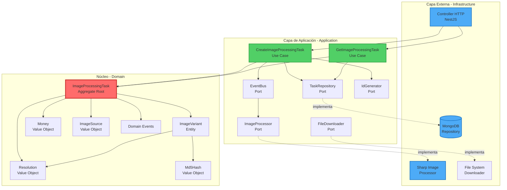
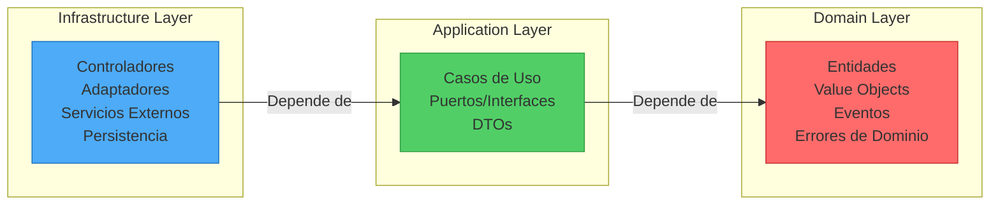
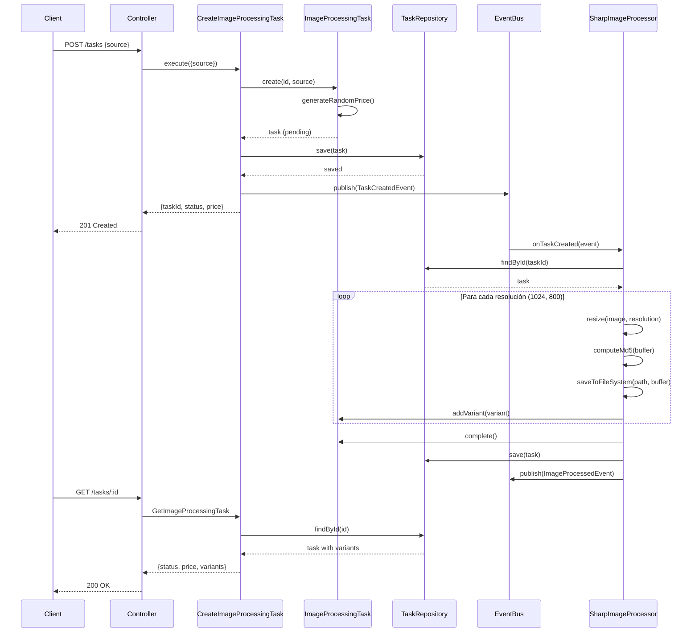

# Hexagonal Image Service

API REST de procesamiento de imágenes construida con NestJS y TypeScript siguiendo Arquitectura Hexagonal (Puertos y Adaptadores).

## 📋 Tabla de Contenidos

- [Descripción General](#-descripción-general)
- [Arquitectura](#-arquitectura)
  - [Arquitectura Hexagonal](#arquitectura-hexagonal)
  - [Capas del Sistema](#capas-del-sistema)
  - [Flujo de Procesamiento](#flujo-de-procesamiento)
  - [Estructura de Directorios](#estructura-de-directorios)
- [Decisiones Técnicas](#-decisiones-técnicas)
- [Requisitos Previos](#-requisitos-previos)
- [Instalación y Configuración](#-instalación-y-configuración)
- [Comandos Disponibles](#-comandos-disponibles)
- [Uso de la API](#-uso-de-la-api)
- [Testing](#-testing)
- [Documentación Adicional](#-documentación-adicional)

---

## 🎯 Descripción General

Este proyecto implementa un servicio REST para el procesamiento de imágenes que:

- **Recibe** una ruta local o URL de una imagen
- **Genera** dos variantes redimensionadas (1024px y 800px de ancho)
- **Mantiene** el aspect ratio original
- **Almacena** las imágenes procesadas con nomenclatura basada en hash MD5
- **Gestiona** el ciclo de vida de las tareas de procesamiento (pending → completed/failed)
- **Asigna** un precio aleatorio entre 5 y 50 a cada tarea

### Tecnologías Principales

- **Framework**: NestJS 11
- **Lenguaje**: TypeScript 5.7
- **Base de Datos**: MongoDB 7.0
- **Procesamiento de Imágenes**: Sharp 0.34
- **Documentación**: Swagger/OpenAPI
- **Testing**: Jest 30 (unitarios e integración)

---

## 🏗 Arquitectura

### Arquitectura Hexagonal

El proyecto sigue los principios de **Arquitectura Hexagonal** (también conocida como Ports & Adapters), que separa la lógica de negocio del núcleo de las preocupaciones técnicas externas.



### Capas del Sistema



#### 1. **Domain (Núcleo de Negocio)**

Contiene la lógica de negocio pura, independiente de frameworks y tecnologías externas.

- **Entidades**:
  - `ImageProcessingTask` (Aggregate Root): Gestiona el ciclo de vida de una tarea
  - `ImageVariant`: Representa una imagen procesada a una resolución específica
- **Value Objects**:
  - `Money`: Precio inmutable entre 5-50
  - `Resolution`: Resoluciones válidas (1024px, 800px)
  - `ImageSource`: Validación de rutas y URLs
  - `Md5Hash`: Hash de identificación de archivos
- **Eventos de Dominio**:
  - `TaskCreatedEvent`: Se dispara al crear una tarea
  - `ImageProcessedEvent`: Se dispara cuando se completa el procesamiento
  - `ImageProcessingFailed`: Se dispara ante errores de procesamiento

- **Invariantes del Dominio**:
  - Una tarea completada debe tener exactamente 2 variantes
  - El precio es inmutable una vez asignado
  - Transiciones válidas: `pending → completed` o `pending → failed`

#### 2. **Application (Orquestación)**

Define los casos de uso y los contratos (ports) que debe cumplir la infraestructura.

- **Casos de Uso**:
  - `CreateImageProcessingTask`: Crea una nueva tarea de procesamiento
  - `GetImageProcessingTask`: Consulta el estado de una tarea
- **Puertos (Interfaces)**:
  - `TaskRepository`: Persistencia de tareas
  - `ImageProcessor`: Procesamiento de imágenes
  - `FileDownloader`: Descarga de archivos
  - `EventBus`: Sistema de eventos
  - `IdGenerator`: Generación de identificadores

#### 3. **Infrastructure (Detalles Técnicos)**

Implementa los adaptadores para los puertos definidos en la capa de aplicación.

- **Controladores**: `TaskController` (REST endpoints con NestJS)
- **Adaptadores**:
  - `MongoTaskRepository`: Implementación de persistencia en MongoDB
  - `SharpImageProcessor`: Procesamiento con librería Sharp
  - `FileDownloaderService`: Descarga de archivos locales/remotos
- **Listeners**: Escuchan eventos de dominio y ejecutan el procesamiento asíncrono

### Flujo de Procesamiento



### Estructura de Directorios

```
src/
├── domain/                      # Capa de Dominio
│   ├── entities/               # Entidades y Aggregate Roots
│   │   ├── image-processing-task.model.ts
│   │   └── image-variant.model.ts
│   ├── value-objects/          # Objetos de Valor inmutables
│   │   ├── money.value.ts
│   │   ├── resolution.value.ts
│   │   ├── image-source.value.ts
│   │   └── md5hash.value.ts
│   ├── events/                 # Eventos de Dominio
│   │   ├── task-created.event.ts
│   │   ├── image-processed.event.ts
│   │   └── image-processing-failed.event.ts
│   └── errors/                 # Errores de Dominio
│       ├── domain.error.ts
│       ├── task-not-found.error.ts
│       └── ...
│
├── application/                 # Capa de Aplicación
│   ├── use-cases/              # Casos de Uso
│   │   ├── create-image-processing-task.use-case.ts
│   │   └── get-image-processing-task.use-case.ts
│   ├── ports/                  # Interfaces (Puertos)
│   │   ├── task.repository.ts
│   │   ├── image.processor.ts
│   │   ├── file.downloader.ts
│   │   ├── event.bus.ts
│   │   └── id.generator.ts
│   └── dtos/                   # Data Transfer Objects
│       ├── create-task.dto.ts
│       └── get-task.dto.ts
│
├── infrastructure/              # Capa de Infraestructura
│   ├── controllers/            # Controladores REST
│   │   └── task.controller.ts
│   ├── repositories/           # Implementaciones de Repositorios
│   │   ├── mongo-task.repository.ts
│   │   └── in-memory-task.repository.ts
│   ├── services/               # Implementaciones de Servicios
│   │   ├── sharp-image.processor.ts
│   │   └── file-downloader.service.ts
│   ├── listeners/              # Event Listeners
│   │   └── image-processed.listener.ts
│   ├── filters/                # Exception Filters
│   │   └── domain-exception.filter.ts
│   ├── modules/                # Módulos de NestJS
│   │   └── task.module.ts
│   └── dtos/                   # DTOs de API (validación)
│       ├── create-task.dto.ts
│       └── get-task.dto.ts
│
├── app.module.ts               # Módulo principal
└── main.ts                     # Punto de entrada
```

---

## 💡 Decisiones Técnicas

### 1. **Arquitectura Hexagonal**

**Decisión**: Implementar arquitectura hexagonal estricta con separación clara de capas.

**Argumentos**:

- **Testabilidad**: El dominio puede probarse sin dependencias externas
- **Mantenibilidad**: Cambios en infraestructura no afectan la lógica de negocio
- **Flexibilidad**: Fácil reemplazar adaptadores (ej: cambiar MongoDB por PostgreSQL)
- **Claridad**: Separación explícita de responsabilidades

**Trade-offs**:

- Mayor cantidad de archivos y abstracciones
- Curva de aprendizaje para desarrolladores no familiarizados

### 2. **Procesamiento Síncrono con Eventos**

**Decisión**: Procesamiento de imágenes activado por eventos de dominio, pero ejecutado síncronamente en el mismo proceso.

**Argumentos**:

- **Simplicidad**: No requiere infraestructura de colas (Redis, RabbitMQ)
- **Suficiente para el alcance**: Volumen de procesamiento esperado es bajo
- **Desarrollo rápido**: Menos dependencias y configuración
- **Transición fácil**: El patrón de eventos permite migrar a procesamiento asíncrono real si se necesita

**Trade-offs**:

- El endpoint puede tardar más en responder (aunque responde 201 antes del procesamiento)
- No hay distribución de carga entre workers
- Reintentos ante fallos requieren implementación manual

### 3. **MongoDB como Base de Datos**

**Decisión**: Usar MongoDB con documentos embebidos para almacenar tareas y variantes.

**Argumentos**:

- **Modelo de datos natural**: Las variantes son parte del agregado de la tarea
- **Consultas simples**: Típicamente se recupera la tarea con todas sus variantes
- **Sin joins**: Mejor rendimiento para lecturas
- **Flexibilidad de esquema**: Fácil agregar campos sin migraciones complejas

**Estructura de Documento dentro de tasks**:

```json
{
    _id: '06ks2xz',
    status: 'completed',
    price: 50,
    createdAt: ISODate('2025-11-04T17:51:13.563Z'),
    updatedAt: ISODate('2025-11-04T17:52:20.143Z'),
    originalPath: 'https://images.unsplash.com/photo-1648733366513-7cefc88f28ca?ixlib=rb-4.1.0&ixid=M3wxMjA3fDB8MHxzZWFyY2h8Mnx8bG9ybyUyMGdyYW5kZXxlbnwwfHwwfHx8MA%3D%3D&fm=jpg&q=60&w=3000',
    images: [
      {
        resolution: '1024',
        path: 'images/output/photo-1648733366513-7cefc88f28ca/1024/2de2dd79923887f8ce34bb4912985bab.jpg',
        md5: '2de2dd79923887f8ce34bb4912985bab'
      },
      {
        resolution: '800',
        path: 'images/output/photo-1648733366513-7cefc88f28ca/800/2de2dd79923887f8ce34bb4912985bab.jpg',
        md5: '2de2dd79923887f8ce34bb4912985bab'
      }
    ]
  }
```

** Estructura de Documento en colección images (opcional)**:

```json
{
    _id: '06ks2xz_1024',
    taskId: '06ks2xz',
    resolution: '1024',
    path: 'images/output/photo-1648733366513-7cefc88f28ca/1024/2de2dd79923887f8ce34bb4912985bab.jpg',
    md5: '2de2dd79923887f8ce34bb4912985bab',
    timestamp: ISODate('2025-11-04T17:52:20.143Z')
  },
  {
    _id: '06ks2xz_800',
    taskId: '06ks2xz',
    resolution: '800',
    path: 'images/output/photo-1648733366513-7cefc88f28ca/800/2de2dd79923887f8ce34bb4912985bab.jpg',
    md5: '2de2dd79923887f8ce34bb4912985bab',
    timestamp: ISODate('2025-11-04T17:52:20.143Z')
  }
```

**Trade-offs**:

- No hay consistencia ACID entre colecciones
- Duplicación de datos en colecciones tasks e images

### 4. **Almacenamiento Local de Imágenes**

**Decisión**: Guardar imágenes procesadas en el sistema de archivos local bajo `/images/output/`.

**Patrón de Almacenamiento**: `/output/{nombre_original}/{resolución}/{md5}.{ext}`

**Argumentos**:

- **Simplicidad**: No requiere configuración de buckets S3 o similar
- **Desarrollo local**: Fácil inspección y debugging
- **Sin costos**: No hay costos de almacenamiento cloud
- **Suficiente para MVP**: El volumen esperado es manejable

**Trade-offs**:

- No es escalable horizontalmente (cada instancia tiene su propio filesystem)
- Sin CDN integrado para servir imágenes
- Backups dependen del filesystem del servidor

### 5. **Value Objects Inmutables**

**Decisión**: Usar Value Objects para conceptos de dominio (`Money`, `Resolution`, `ImageSource`, `Md5Hash`).

**Argumentos**:

- **Validación centralizada**: La lógica de validación vive en el Value Object
- **Inmutabilidad**: Previene bugs por modificaciones accidentales
- **Type Safety**: TypeScript garantiza tipos correctos en tiempo de compilación
- **Expresividad**: `Money.randomBetween()` es más claro que `Math.random() * 45 + 5`

**Ejemplo**:

```typescript
// ❌ Antes (primitivo)
const price = Math.random() * 45 + 5;

// ✅ Después (Value Object)
const price = Money.randomBetween(); // Encapsula lógica y validación
```

### 6. **Aggregate Root: ImageProcessingTask**

**Decisión**: `ImageProcessingTask` es el Aggregate Root que controla el acceso a `ImageVariant`.

**Argumentos**:

- **Consistencia**: Solo la tarea puede modificar sus variantes
- **Invariantes garantizados**: La tarea asegura que haya exactamente 2 variantes al completarse
- **Transaccionalidad**: Todos los cambios pasan por el agregado

**Invariantes Implementadas**:

```typescript
// Solo se pueden agregar variantes si la tarea está pending
addVariant(variant: ImageVariant) {
  if (this._status !== 'pending') {
    throw new AddVariantError('Cannot add variants to non-pending task');
  }
  this._variants.push(variant);
}

// Solo se puede completar si hay exactamente 2 variantes
  complete() {
    if (this._status !== 'pending') {
      throw new CompleteTaskError('Only pending tasks can be completed');
    }
    if (this._variants.length !== 2) {
      throw new CompleteTaskError(
        'A completed task must have exactly 2 variants',
      );
    }
    this._status = 'completed';
  }
```

### 7. **Eventos de Dominio vs Eventos de Integración**

**Decisión**: Usar eventos de dominio para comunicación interna; preparados para eventos de integración futuros.

**Argumentos**:

- **Desacoplamiento**: El caso de uso no conoce al procesador de imágenes
- **Extensibilidad**: Fácil agregar más listeners (ej: enviar email, notificaciones)
- **Patrón CQRS-ready**: Base para implementar CQRS si se necesita

**Implementación**:

```typescript
// Caso de uso publica evento
await this.eventBus.publish(new TaskCreatedEvent(id, source.uri));

// Procesador se suscribe al evento
this.eventBus.subscribe(TaskCreatedQueue, async (ev: TaskCreatedEvent) => {
  await this.onTaskCreated(ev);
});
```

### 8. **Testing Strategy**

**Decisión**: Tests unitarios colocados junto al código (`src/`), tests de integración en carpeta separada (`test/`).

**Estructura**:

```
src/
  domain/
    entities/
      image-processing-task.model.ts
      image-processing-task.spec.ts        # ← Test unitario
  application/
    use-cases/
      create-image-processing-task.use-case.ts
      create-image-processing-task.spec.ts  # ← Test unitario
test/
  tasks.e2e-spec.ts                         # ← Test E2E
```

**Argumentos**:

- **Colocación**: Tests unitarios cerca del código facilita navegación
- **Feedback rápido**: Tests unitarios se ejecutan en milisegundos
- **Separación**: Tests E2E más lentos están aislados en `test/`
- **CI/CD**: Posibilidad de ejecutar unitarios y E2E en pipelines separados

**Cobertura Actual**:

- ✅ Domain entities con tests unitarios completos
- ✅ Use cases con tests unitarios (usando mocks)
- ✅ Tests E2E del flujo completo de API
- ✅ Cobertura > 80% (excluyendo archivos de configuración)

### 9. **Sharp para Procesamiento de Imágenes**

**Decisión**: Usar Sharp como librería de procesamiento de imágenes.

**Argumentos**:

- **Rendimiento**: Basado en libvips, extremadamente rápido
- **Soporte de formatos**: JPEG, PNG, WebP, AVIF, TIFF, GIF, SVG
- **API ergonómica**: Fluent API fácil de usar
- **Mantenimiento activo**: Librería ampliamente usada y mantenida

### 10. **Swagger para Documentación**

**Decisión**: Usar Swagger/OpenAPI con decoradores de NestJS para documentar la API.

**Argumentos**:

- **Documentación viva**: Se actualiza automáticamente con el código
- **Testing interactivo**: Interfaz web para probar endpoints (`/api/docs`)
- **Generación de clientes**: Posibilidad de generar SDKs automáticamente
- **Estándar de industria**: OpenAPI es el estándar de facto

**Acceso**: `http://localhost:3000/api/docs`

### 11. **Sin Autenticación en MVP**

**Decisión**: No implementar autenticación ni autorización en esta versión inicial.

**Argumentos**:

- **Scope limitado**: Prueba técnica enfocada en arquitectura y procesamiento
- **Simplicidad**: Reduce complejidad innecesaria para el objetivo
- **Futuro**: Arquitectura preparada para agregar middleware de auth

**Para Producción se Requeriría**:

- JWT authentication
- Rate limiting
- API keys o OAuth2
- Validación de origen de requests

### 12. **TypeScript Strict Mode**

**Decisión**: Habilitar modo estricto de TypeScript (`strict: true`).

**Argumentos**:

- **Seguridad de tipos**: Detecta errores en tiempo de compilación
- **Null safety**: Manejo explícito de `null` y `undefined`
- **Mejor DX**: IntelliSense más preciso
- **Menos bugs en runtime**: Prevención de errores comunes

**Configuración**:

```json
{
  "compilerOptions": {
    "strict": true,
    "strictNullChecks": true,
    "strictFunctionTypes": true,
    "noImplicitAny": true
  }
}
```

### 13. **Convenciones de Commits**

**Decisión**: Usar Conventional Commits con Husky + Commitlint.

**Argumentos**:

- **Historial claro**: Commits estructurados y legibles
- **Changelog automático**: Posibilidad de generar CHANGELOG.md
- **Semantic versioning**: Facilita determinación de versiones
- **Colaboración**: Estándar conocido por la comunidad

**Formato**: `<type>(<scope>): <subject>`

**Tipos permitidos**: `feat`, `fix`, `docs`, `style`, `refactor`, `test`, `chore`

### 14. **Gestión de Errores con Filtros**

**Decisión**: Usar Exception Filters de NestJS para mapear errores de dominio a respuestas HTTP.

**Argumentos**:

- **Separación de concerns**: El dominio no conoce HTTP status codes
- **Consistencia**: Formato de error uniforme en toda la API
- **DRY**: Un solo lugar para mapear errores

**Implementación**:

```typescript
@Catch(DomainError)
export class DomainExceptionFilter implements ExceptionFilter {
  catch(exception: DomainError, host: ArgumentsHost) {
    const ctx = host.switchToHttp();
    const response = ctx.getResponse<Response>();

    const type = exception.name;

    switch (type) {
      case InvalidImageSourceError.name:
        return response.status(HttpStatus.BAD_REQUEST).json({
          message: [exception.message],
          error: exception.constructor.name,
          statusCode: HttpStatus.BAD_REQUEST,
        });
      case TaskNotFoundError.name:
        return response.status(HttpStatus.NOT_FOUND).json({
          message: [exception.message],
          error: exception.constructor.name,
          statusCode: HttpStatus.NOT_FOUND,
        });
      default:
        return response.status(HttpStatus.INTERNAL_SERVER_ERROR).json({
          statusCode: HttpStatus.INTERNAL_SERVER_ERROR,
          error: 'Internal server error',
          type: exception.constructor.name,
        });
    }
  }
}
```

---

## 📦 Requisitos Previos

Antes de comenzar, asegúrate de tener instalado:

- **Node.js**: >= 18.x (recomendado 20.x LTS)
- **npm**: >= 9.x (incluido con Node.js)
- **Docker** >= 20.x para ejecutar MongoDB en contenedor
- **MongoDB**: 7.0 indicado por imagen de Docker

Verificar instalación:

```bash
node --version
npm --version
docker --version  # opcional
```

---

## 🚀 Instalación y Configuración

### 1. Clonar el Repositorio

```bash
git clone https://github.com/tu-usuario/hexagonal-image-service.git
cd hexagonal-image-service
```

### 2. Instalar Dependencias

```bash
npm install
```

Esto instalará todas las dependencias necesarias:

- NestJS framework y módulos
- Sharp para procesamiento de imágenes
- Mongoose para MongoDB
- Jest para testing
- Y todas las dependencias de desarrollo (TypeScript, ESLint, Prettier, etc.)

### 3. Configurar Variables de Entorno

Crear archivo `.env` en la raíz del proyecto (opcional, hay defaults):

```env
# Puerto del servidor (default: 3000)
PORT=3000

# URI de MongoDB (default: mongodb://localhost:27017/image_service)
MONGO_URI=mongodb://localhost:27017/image_service
```

### 4. Iniciar MongoDB

**Opción A: Usar Docker (Recomendado)**

```bash
npm run docker:up
```

Este comando levanta MongoDB en un contenedor Docker con la configuración definida en `docker-compose.yml`.

### 5. Preparar Base de Datos ()

Si necesitas ejecutar migraciones o setup inicial:

```bash
npm run db:setup
```

Este comando:

1. Levanta Docker con MongoDB (`docker:up`)
2. Espera 5 segundos para que MongoDB esté listo
3. Ejecuta el script de migración (`db:migrate`)

### 6. Crear Directorio de Salida

Asegúrate de que existe el directorio para imágenes de salida:

```bash
mkdir -p images/output
```

El directorio `images/input` puede contener imágenes de prueba (opcional).

### 7. Iniciar la Aplicación

**Modo Desarrollo (con hot-reload):**

```bash
npm run start:dev
```

**Modo Producción:**

```bash
npm run build
npm run start:prod
```

La aplicación estará disponible en: `http://localhost:3000`

Documentación Swagger: `http://localhost:3000/api/docs`

---

## 📜 Comandos Disponibles

### Desarrollo

| Comando               | Descripción                                         |
| --------------------- | --------------------------------------------------- |
| `npm run start`       | Inicia la aplicación en modo normal                 |
| `npm run start:dev`   | Inicia con hot-reload (recomendado para desarrollo) |
| `npm run start:debug` | Inicia en modo debug (con inspector de Node.js)     |
| `npm run build`       | Compila TypeScript a JavaScript en `/dist`          |

### Testing

| Comando              | Descripción                                                        |
| -------------------- | ------------------------------------------------------------------ |
| `npm run test`       | Ejecuta todos los tests unitarios (archivos `*.spec.ts` en `src/`) |
| `npm run test:watch` | Ejecuta tests en modo watch (re-ejecuta al cambiar archivos)       |
| `npm run test:cov`   | Ejecuta tests y genera reporte de cobertura en `/coverage`         |
| `npm run test:debug` | Ejecuta tests en modo debug                                        |
| `npm run test:e2e`   | Ejecuta tests de integración end-to-end (archivos en `test/`)      |

**Ejemplo de ejecución de tests:**

```bash
# Tests unitarios con watch
npm run test:watch

# Tests E2E
npm run test:e2e

# Cobertura completa
npm run test:cov
```

### Calidad de Código

| Comando          | Descripción                                        |
| ---------------- | -------------------------------------------------- |
| `npm run lint`   | Ejecuta ESLint y corrige problemas automáticamente |
| `npm run format` | Formatea código con Prettier                       |

### Base de Datos y Docker

| Comando                  | Descripción                                           |
| ------------------------ | ----------------------------------------------------- |
| `npm run docker:up`      | Levanta MongoDB en Docker (modo daemon)               |
| `npm run docker:down`    | Detiene y elimina contenedores de Docker              |
| `npm run docker:logs`    | Muestra logs de MongoDB en tiempo real                |
| `npm run docker:restart` | Reinicia el contenedor de MongoDB                     |
| `npm run db:migrate`     | Ejecuta script de migración (`scripts/migrate-db.ts`) |
| `npm run db:setup`       | Setup completo: levanta Docker + ejecuta migraciones  |

### Otros

| Comando           | Descripción                                                 |
| ----------------- | ----------------------------------------------------------- |
| `npm run prepare` | Configura Husky para git hooks (se ejecuta automáticamente) |

---

## 🔌 Uso de la API

### Documentación Interactiva (Swagger)

Accede a `http://localhost:3000/api/docs` para explorar la API de forma interactiva.

### Endpoints Disponibles

#### 1. Crear Tarea de Procesamiento

**POST** `/tasks`

Crea una nueva tarea para procesar una imagen.

**Request Body:**

```json
{
  "source": "/ruta/local/imagen.jpg"
}
```

O con URL:

```json
{
  "source": "https://example.com/imagen.jpg"
}
```

**Response (201 Created):**

```json
{
  "taskId": "nisgqja",
  "price": 40,
  "status": "pending"
}
```

**Ejemplo con curl:**

```bash
curl -X POST http://localhost:3000/tasks \
  -H "Content-Type: application/json" \
  -d '{"source": "/images/input/test.jpg"}'
```

**Validaciones:**

- El campo `source` es requerido
- Debe ser una ruta local válida o una URL con protocolo http/https

#### 2. Consultar Estado de Tarea

**GET** `/tasks/:id`

Obtiene el estado actual y detalles de una tarea.

**Response (200 OK) - Tarea Pendiente:**

```json
{
  "status": "pending",
  "price": 40,
  "paths": []
}
```

**Response (200 OK) - Tarea Completada:**

```json
{
  "taskId": "nisgqja",
  "status": "completed",
  "price": 40,
  "images": [
    {
      "resolution": "1024",
      "path": "images/output/pngtree-cute-cartoon-beach-bear-illustration-png-image_7506687/1024/70036078a8c80f735aaf05306f30e183.png"
    },
    {
      "resolution": "800",
      "path": "images/output/pngtree-cute-cartoon-beach-bear-illustration-png-image_7506687/800/70036078a8c80f735aaf05306f30e183.png"
    }
  ]
}
```

**Response (404 Not Found):**

```json
{
  "message": ["Task with id 'notfound' not found"],
  "error": "TaskNotFoundError",
  "statusCode": 404
}
```

**Ejemplo con curl:**

```bash
curl http://localhost:3000/tasks/507f1f77bcf86cd799439011
```

### Flujo de Trabajo Típico

1. **Crear tarea**: `POST /tasks` con la imagen a procesar
2. **Recibir taskId**: El servidor responde inmediatamente con el ID y estado `pending`
3. **Esperar procesamiento**: El servidor procesa la imagen en segundo plano. Primero procesa la imagen y genera las variantes. Segundo, actualiza el estado a `completed` o `failed`.
4. **Consultar estado**: `GET /tasks/:id` para verificar si el procesamiento finalizó
5. **Obtener variantes**: Cuando `status` es `completed`, la respuesta incluye las rutas de las imágenes procesadas

---

## 🧪 Testing

El proyecto incluye una suite completa de tests:

### Tests Unitarios

Tests rápidos y aislados de la lógica de dominio y aplicación.

```bash
# Ejecutar todos los tests unitarios
npm run test

# Con cobertura
npm run test:cov

# En modo watch (recomendado durante desarrollo)
npm run test:watch
```

**Ubicación**: Tests colocados junto al código (`*.spec.ts` en `src/`)

**Ejemplos**:

- `src/domain/entities/image-processing-task.spec.ts`: Tests del agregado
- `src/application/use-cases/create-image-processing-task.spec.ts`: Tests de casos de uso

### Tests de Integración (E2E)

Tests que validan el flujo completo de la API.

```bash
npm run test:e2e
```

**Ubicación**: `test/tasks.e2e-spec.ts`

**Cobertura E2E**:

- ✅ Creación de tarea con imagen local
- ✅ Creación de tarea con URL
- ✅ Consulta de tarea en estado pending
- ✅ Consulta de tarea completada con variantes
- ✅ Error 404 para taskId inexistente
- ✅ Validación de entrada inválida
- ✅ Manejo de errores de procesamiento

### Reporte de Cobertura

Después de ejecutar `npm run test:cov`, se genera un reporte HTML en:

```
coverage/lcov-report/index.html
```

Abre este archivo en un navegador para ver el reporte detallado.

**Cobertura Actual**:

- Domain: ~95%
- Application: ~90%
- Infrastructure: ~75% (controladores y adaptadores)
- **Global: >80%**

---

## 📚 Documentación Adicional

### Swagger/OpenAPI

Documentación interactiva disponible en: `http://localhost:3000/api/docs`

Permite:

- Explorar todos los endpoints
- Ver esquemas de request/response
- Ejecutar requests directamente desde el navegador
- Descargar la especificación OpenAPI

### Postman Collection

Importa `docs/postman/task.postman_collection.json` en Postman para tener una colección lista con ejemplos de requests.

---
